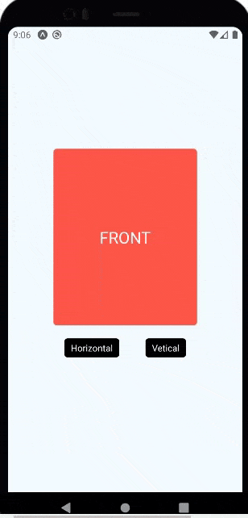
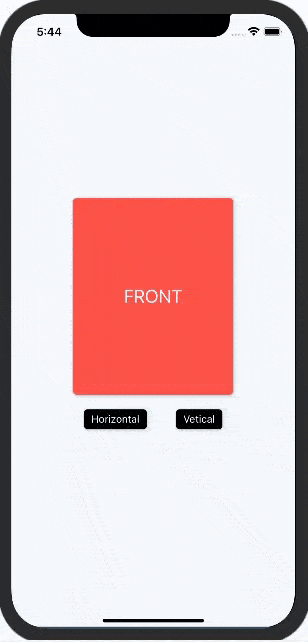

# react-native-flip-card-plus

> The card component which has a motion of flip for React Native(Android/ios) with gestures


## Installation

`npm i react-native-flip-card-plus`


## Look and feel

Once you're up and running

<p align="left">
  
  
</p>


## Usage with single card

```
import React, { Component } from 'react';
import {
  Text,
  View,
  Button,
  StyleSheet,
  TouchableOpacity,
  Pressable,
} from 'react-native';
import FlipCard from "react-native-flip-card-plus";

export default class App extends Component {
  constructor(props) {
    super(props);
    this.card = React.createRef();
  }

  render() {
    return (
      <View style={styles.container}>
        <FlipCard
          flipDirection={"h"}
          style={styles.cardContainer}
          ref={(card) => (this.card = card)}
          onFlipStart={() => console.log('onFlipStart')}
          onFlipEnd={() => console.log('onFlipEnd')}>
          <Pressable
            style={styles.card}
            onLongPress={() => alert('onLongPress')}>
            <Text style={styles.label}>FRONT</Text>
          </Pressable>
          <Pressable style={styles.card} onPress={() => alert('onPress')}>
            <Text style={styles.label}>BACK</Text>
          </Pressable>
        </FlipCard>
        <View style={styles.manualTriggers}>
          <Pressable
            style={styles.trigger}
            onPress={() => this.card.flipHorizontal()}>
            <Text style={{ color: 'white' }}>Horizontal</Text>
          </Pressable>
          <Pressable
            style={styles.trigger}
            onPress={() => this.card.flipVertical()}>
            <Text style={{ color: 'white' }}>Vetical</Text>
          </Pressable>
        </View>
      </View>
    );
  }
}

const styles = StyleSheet.create({
  container: {
    flex: 1,
    justifyContent: 'center',
    alignItems: 'center',
    backgroundColor: '#F5FCFF',
  },
  cardContainer: {
    width: 220,
    height: 270,
  },
  card: {
    width: 220,
    height: 270,
    justifyContent: 'center',
    alignItems: 'center',
    backgroundColor: '#FE474C',
    borderRadius: 5,
    shadowColor: 'rgba(0,0,0,0.5)',
    shadowOffset: {
      width: 0,
      height: 1,
    },
    shadowOpacity: 0.5,
  },
  label: {
    textAlign: 'center',
    fontSize: 25,
    fontFamily: 'System',
    color: '#ffffff',
    backgroundColor: 'transparent',
  },
  manualTriggers: {
    flexDirection: 'row',
  },
  trigger: {
    backgroundColor: 'black',
    margin: 20,
    paddingHorizontal: 10,
    paddingVertical: 5,
    borderRadius: 5,
    shadowColor: 'rgba(0,0,0,0.5)',
    shadowOffset: {
      width: 0,
      height: 1,
    },
    shadowOpacity: 0.5,
  },
});


```


## Usage with multiple cards (MAP)

```
import React, { Component } from 'react';
import { Text, View, Button, StyleSheet, Pressable } from 'react-native';
import FlipCard from "react-native-flip-card-plus";

export default class App extends Component {
  constructor(props) {
    super(props);
    this.multiCardRef = [];
    this.state = {
      cards: ['CARD1', 'CARD2'],
    };
  }

  render() {
    return (
      <View style={styles.container}>
        {this.state.cards.map((item, index) => {
          return (
            <>
              <FlipCard
                flipDirection={'h'}
                style={styles.cardContainer}
                onFlipStart={() => console.log('onFlipStart')}
                onFlipEnd={() => console.log('onFlipEnd')}
                ref={(card) => (this.multiCardRef['card' + index] = card)}>
                <Pressable
                  style={styles.card}
                  onLongPress={() => alert('onLongPress')}>
                  <Text style={styles.label}>{item} Front</Text>
                </Pressable>
                <Pressable style={styles.card} onPress={() => alert('onPress')}>
                  <Text style={styles.label}>{item} Back</Text>
                </Pressable>
              </FlipCard>
              <View style={styles.manualTriggers}>
                <Pressable
                  style={styles.trigger}
                  onPress={() =>
                    this.multiCardRef['card' + index].flipHorizontal()
                  }>
                  <Text style={{ color: 'white' }}>Horizontal</Text>
                </Pressable>
                <Pressable
                  style={styles.trigger}
                  onPress={() =>
                    this.multiCardRef['card' + index].flipVertical()
                  }>
                  <Text style={{ color: 'white' }}>Vetical</Text>
                </Pressable>
              </View>
            </>
          );
        })}
      </View>
    );
  }
}

const styles = StyleSheet.create({
  container: {
    flex: 1,
    justifyContent: 'center',
    alignItems: 'center',
    backgroundColor: '#F5FCFF',
  },
  cardContainer: {
    width: 220,
    height: 270,
  },
  card: {
    width: 220,
    height: 270,
    justifyContent: 'center',
    alignItems: 'center',
    backgroundColor: '#FE474C',
    borderRadius: 5,
    shadowColor: 'rgba(0,0,0,0.5)',
    shadowOffset: {
      width: 0,
      height: 1,
    },
    shadowOpacity: 0.5,
  },
  label: {
    textAlign: 'center',
    fontSize: 25,
    fontFamily: 'System',
    color: '#ffffff',
    backgroundColor: 'transparent',
  },
  manualTriggers: {
    flexDirection: 'row',
  },
  trigger: {
    backgroundColor: 'black',
    margin: 20,
    paddingHorizontal: 10,
    paddingVertical: 5,
    borderRadius: 5,
    shadowColor: 'rgba(0,0,0,0.5)',
    shadowOffset: {
      width: 0,
      height: 1,
    },
    shadowOpacity: 0.5,
  },
});


```


## props
| Props               | type          | description                     | required      | default       |
| --------------------| ------------- | --------------------------------| ------------- | ------------- |
| style               | object        | container style                 |               | {}            |
| duration            | number        | flip duration                   |               | 1000          |
| flipZoom            | number        | zoom level on flip              |               | 0.09          |
| flipDirection       | string        | 'h' or 'v'                      | if swipeable  | 'h'           |
| perspective         | number        |                                 |               | 800           |
| flipHorizontal      | function      | Flip horizontal trigger         |               |               |
| flipVertical        | function      | Flip vertical trigger           |               |               |
| swipeable           | bool          | enable/disable gesture swipe    |               | true          |


## events
| Props             | type          | description                 |
| ----------------- | ------------- | --------------------------- |
| onFlipStart       | func           | function to be called when the flip-animation starts. it receives the card-sides index   |
| onFlipEnd         | func           | function to be called when the flip-animation ends. it receives the card-sides index   |
 

## Credits

Inspired by [react-native-card-flip](https://github.com/lhandel/react-native-card-flip)


